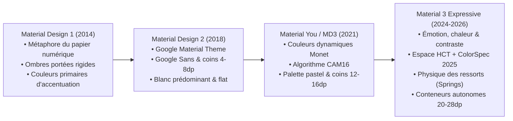
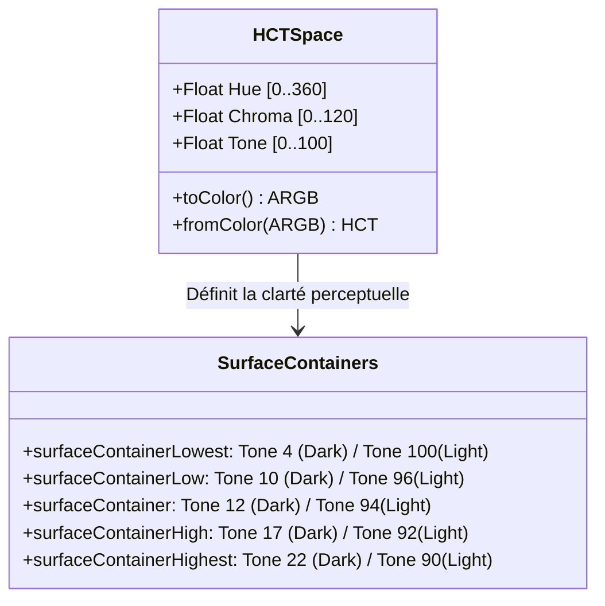

# 🎨 Analyse Approfondie du Style Google & Material Design 3 Expressive (M3E)

> **Projet :** Materialy Music  
> **Auteur / Référence :** Équipe Architecture & Design Système  
> **Source de référence :** [m3.material.io](https://m3.material.io/), Google I/O Design Guidelines, Android 15/16 System Design  
> **Date :** 22 Septembre 2026  
> **Statut :** Spécification Maîtresse d'Architecture Visuelle & Interaction

---

## Table des Matières
1. [Évolution de l'Identité Visuelle Google : De Material 1 à M3 Expressive](#1-évolution-de-lidentité-visuelle-google--de-material-1-à-m3-expressive)
2. [L'Analyse des Applications Google de Première Ligne (First-Party)](#2-lanalyse-des-applications-google-de-première-ligne-first-party)
3. [La Science Mathématique de la Couleur : Modèle HCT & Harmonisation Dynamique](#3-la-science-mathématique-de-la-couleur--modèle-hct--harmonisation-dynamique)
4. [Typographie Éditoriale & Système d'Axes Variables](#4-typographie-éditoriale--système-daxes-variables)
5. [Morphologie des Formes & Géométrie Expressive](#5-morphologie-des-formes--géométrie-expressive)
6. [Physique du Mouvement (Spring Dynamics & Spatial Tokens)](#6-physique-du-mouvement-spring-dynamics--spatial-tokens)
7. [Anatomie Détaillée des Composants M3 Expressive](#7-anatomie-détaillée-des-composants-m3-expressive)
8. [Expérience Audio & UX « Signature » : Le Cas de « Моя Волна »](#8-expérience-audio--ux-signature--le-cas-de--моя-волна-)
9. [Directives d'Implémentation & Règles d'Or Jetpack Compose](#9-directives-dimplémentation--règles-dor-jetpack-compose)

---

## 1. Évolution de l'Identité Visuelle Google : De Material 1 à M3 Expressive



### 1.1. Les lacunes historiques du MD3 initial
Introduit avec Android 12, le premier jet de **Material You** a posé des bases révolutionnaires avec l'extraction de palette dynamique depuis le fond d'écran de l'utilisateur. Cependant, les retours utilisateurs et audits d'ergonomie ont mis en lumière plusieurs faiblesses critiques :
- **Monotonie pastel & manque de contraste :** La désaturation excessive donnait un aspect « délavé » aux applications, posant des soucis d'accessibilité visuelle (WCAG) en plein soleil.
- **Flou structurel (Surface Tinting) :** L'élévation en mode sombre était gérée par une couche semi-transparente de couleur primaire (`surfaceTint`) appliquée sur le fond. Cela produisait des gris sales, blanchâtres ou boueux, effaçant la hiérarchie visuelle.
- **Animations mécaniques :** Les courbes de Bézier cubiques classiques (`FastOutSlowIn`) avec durées temporelles fixes (200 ms, 300 ms) ne s'adaptaient pas à l'énergie cinétique ni à la vitesse de l'utilisateur.
- **Répétition formelle :** Toutes les cartes et conteneurs partageaient le même rayon d'angle moyen (12-16 dp), créant une sensation de grille uniforme et statique.

### 1.2. Le tournant « Expressive » de Google
À partir d'Android 15 et 16, Google a opéré une refonte philosophique majeure :
1. **L'émotion au service de la fonction :** Fin de la neutralité stérile. Les formes s'étirent, vibrent, adoptent des formes de pilules géantes (`pills`), d'ovales et de cercles asymétriques.
2. **La lumière par la luminance HCT :** Remplacement des ombres et du `surfaceTint` par **5 niveaux discrets de conteneurs de surface** (`SurfaceContainer`), garantissant une séparation nette sans artifice de calque.
3. **La physique organique des ressorts :** Chaque interaction tactile (tap, drag, swipe, release) transfère sa quantité de mouvement grâce aux ressorts physiques (`SpringSpec`) non amortis ou semi-critiques.
4. **L'adaptation multi-écrans & Edge-to-Edge :** L'application n'a plus de boîte extérieure ; elle fusionne avec l'écran sous la barre d'état et la barre de navigation.

---

## 2. L'Analyse des Applications Google de Première Ligne (First-Party)

L'étude des applications phares de Google révèle les codes récents du style :

### 2.1. YouTube Music
- **Écran de lecture Now Playing :** Pochette carrée avec rayon de 24 dp flottant sur un dégradé flouté issu des teintes dominantes. Barre de progression dynamique avec tête de lecture élastique.
- **Mini-lecteur flottant (Floating MiniPlayer Dock) :** Ce n'est plus une barre rigide attachée au bas, mais une île flottante surélevée de 8 dp au-dessus de la barre de navigation, avec coins très arrondis (20 dp) et boutons d'action compacts.
- **Navigation pills :** Les onglets du bas sont centrés, avec un indicateur sous forme de pilule horizontale (64×32 dp) qui s'anime élastiquement lors du changement de sélection.

### 2.2. Google Pixel Recorder & Horloge
- **Réactivité sonore en temps réel :** Visualisation des ondes audio avec déformations organiques fluides, bulles de gradient pulsantes au rythme des fréquences de basse.
- **Typographie monumentale :** Chiffres et chronomètres rendus en `DisplayLarge` avec police variable ultra-lisible.

### 2.3. Google Play Store & Google Files
- **Carrousels Multi-Browse :** Défilement horizontal où les cartes adjacentes sont coupées intentionnellement pour indiquer l'affordance de défilement, avec rétrécissement progressif sur les bords.
- **Boutons connectés & Segments :** Les filtres ne sont pas des onglets rigides mais des puces (Chips) et boutons d'action segmentés aux angles morphants.

---

## 3. La Science Mathématique de la Couleur : Modèle HCT & Harmonisation Dynamique



### 3.1. Pourquoi le modèle RGB / HSL est obsolète pour l'UI
L'espace sRGB et même HSL ne sont pas **perceptuellement uniformes**. Dans l'espace HSL, un jaune à 50% de luminosité apparaît infiniment plus éblouissant à l'œil humain qu'un bleu à 50% de luminosité. Cela rend impossible la génération algorithmique de contrastes accessibles garantis.

### 3.2. Le modèle HCT (Hue, Chroma, Tone)
Développé par les chercheurs en colorimétrie de Google, l'espace HCT résout cette équation :
- **Hue (Teinte $H$) :** Position angulaire sur la roue chromatique $[0^\circ, 360^\circ]$.
- **Chroma (Saturation $C$) :** Pureté et vibration de la couleur. En M3 Expressive, la valeur cible de Chroma pour les accents `primary` est augmentée de 20% par rapport au MD3 de 2021.
- **Tone (Clarté $T$) :** Équivalent exact de la luminance perceptuelle $L^*$ de l'espace CIELAB $[0, 100]$. **Une différence de $\Delta T = 40$ garantit toujours un ratio de contraste d'au moins 3:1 ; une différence de $\Delta T = 50$ garantit 4.5:1 (norme WCAG AA).**

### 3.3. Hiérarchie des conteneurs de surface (SurfaceContainer Architecture)
Dans **Materialy Music**, nous bannissons définitivement l'ancien `surfaceTint`. La profondeur est orchestrée par les 5 niveaux :

| Niveau de Conteneur | Valeur Tone (Dark Theme) | Valeur Tone (Light Theme) | Rôle dans Materialy Music |
|---|---|---|---|
| **`surfaceContainerLowest`** | **Tone 4** | Tone 100 | Fond du grand lecteur plein écran, canevas infini |
| **`surfaceContainerLow`** | **Tone 10** | Tone 96 | Arrière-plan général des écrans sous les listes |
| **`surfaceContainer`** | **Tone 12** | Tone 94 | Cartes de base, fond de la `NavigationBar` |
| **`surfaceContainerHigh`** | **Tone 17** | Tone 92 | MiniPlayer flottant, puces d'ambiance, fenêtres modales |
| **`surfaceContainerHighest`** | **Tone 22** | Tone 90 | Champs de saisie (Search), boutons de contrôle inactifs, curseurs |

### 3.4. Règle d'or : Isolation de la palette de la pochette
L'un des défauts majeurs identifiés dans notre audit précédent était la contagion des couleurs : extraire une couleur vive d'une pochette jaune ou rouge recoloriait agressivement l'intégralité de l'application, y compris la barre de navigation et les paramètres système.

**Règle d'or d'harmonisation adoptée :**
- **Accents locaux (Local Scope) :** La couleur extraite de la pochette est injectée via `DynamicThemeManager` sous forme d'un `coverColorScheme` local, restreint à la zone du lecteur, de la sphère « Моя Волна » et de la barre de progression.
- **Accents globaux (Global Scope) :** La navigation principale, la barre d'état, la liste des paramètres et les boîtes de dialogue système conservent des teintes système neutres ou subtilement harmonisées par décalage chromatique avec une saturation bridée ($C \le 24$).

---

## 4. Typographie Éditoriale & Système d'Axes Variables

### 4.1. Les Rôles Standards et leurs Variantes « Emphasized »
Material 3 Expressive étend la grille typographique de base en formalisant les variantes **Emphasized** :

```
Display Large       [57sp / 64sp line / -0.25 tracking] -> Regular / Medium
Display Medium      [45sp / 52sp line / 0.0 tracking]   -> Regular / SemiBold
Display Small       [36sp / 44sp line / 0.0 tracking]   -> Bold (Hero « Моя Волна »)
Headline Large      [32sp / 40sp line / 0.0 tracking]   -> SemiBold
Headline Medium     [28sp / 36sp line / 0.0 tracking]   -> Bold (Titre du morceau actif)
Headline Small      [24sp / 32sp line / 0.0 tracking]   -> SemiBold (Sections : « Nouveautés »)
Title Large         [22sp / 28sp line / 0.0 tracking]   -> SemiBold
Title Medium        [16sp / 24sp line / +0.15 tracking] -> Medium / SemiBold (Titres de pistes)
Title Small         [14sp / 20sp line / +0.1 tracking]  -> SemiBold (Badges, sous-titres)
Body Large          [16sp / 24sp line / +0.5 tracking]  -> Regular (Paroles karaoké, bios)
Body Medium         [14sp / 20sp line / +0.25 tracking] -> Regular (Artiste, album)
Body Small          [12sp / 16sp line / +0.4 tracking]  -> Regular (Métadonnées, débits)
Label Large         [14sp / 20sp line / +0.1 tracking]  -> SemiBold (Boutons d'action)
Label Medium        [12sp / 16sp line / +0.5 tracking]  -> SemiBold (Puces, onglets)
Label Small         [11sp / 16sp line / +0.5 tracking]  -> SemiBold (Timecodes 02:45 / 03:30)
```

### 4.2. Polices Variables : Roboto Flex & Google Sans
L'usage de polices statiques (TrueType standards) figeait la mise en page. M3 Expressive s'appuie sur la flexibilité des polices variables via 4 axes clés :
1. **`wght` (Weight) :** Échelle continue de 100 à 900. Permet des transitions fluides sans sauts brusques lors du survol ou de la sélection.
2. **`wdth` (Width) :** De 75% (condensé pour les longs titres de morceaux) à 125% (étendu pour les titres de sections).
3. **`opsz` (Optical Size) :** Ajustement automatique du contraste des hampes et empattements selon la taille du rendu (6 pt à 144 pt).
4. **`GRAD` (Grade) :** Ajuste la graisse perçue du texte entre thème clair et thème sombre sans altérer la largeur ni provoquer de reflow de texte.

---

## 5. Morphologie des Formes & Géométrie Expressive

L'ère des rectangles aux coins légèrement arrondis est révolue. M3 Expressive adopte des formes audacieuses :

```
Forme                Rayon (dp) / Formule        Utilisation dans Materialy
─────────────────────────────────────────────────────────────────────────────
Full Pill            50% (Circle / Capsule)      Boutons Play, Chips filtres, badges
Extra Large Rounded  28 dp                       Grandes cartes d'albums, Dialogue M3E
Large Rounded        20-24 dp                    MiniPlayer flottant, BottomSheet
Medium Rounded       16 dp                       Cartes secondaires, conteneurs EQ
Small Rounded        12 dp                       Vignettes de morceaux (Covers 52x52)
Asymmetric Cut/Morph Rayons hétérogènes         Éléments actifs en transition
```

### 5.1. Effet de rebond haptique (`bouncy` modifier)
Dans notre implémentation Jetpack Compose, chaque élément interactif clé (cartes, boutons de lecture, puces de filtres) est enrichi d'un modificateur de physique :
```kotlin
fun Modifier.bouncy(
    scaleDown: Float = 0.94f,
    stiffness: Float = Spring.StiffnessMediumLow,
    dampingRatio: Float = Spring.DampingRatioMediumBouncy
): Modifier
```
Lors de l'appui du doigt (`isPressed`), le composant s'écrase légèrement ($0.94\times$), puis rebondit avec une onde élastique naturelle lors du relâchement, créant un sentiment de toucher physique et tactile.

---

## 6. Physique du Mouvement (Spring Dynamics & Spatial Tokens)

### 6.1. Remplacement des courbes temporelles par des ressorts
Dans M3 Expressive, la durée en millisecondes n'est plus fixée de manière arbitraire. Le mouvement est régi par la loi de Hooke avec frottement :

$$F = -k \cdot x - c \cdot v$$

Où $k$ représente la rigidité (`stiffness`), $c$ le coefficient d'amortissement (`dampingRatio`), $x$ le déplacement et $v$ la vitesse initiale.

### 6.2. La Matrice des Spécifications de Mouvement Google M3E

| Spécification M3 | Damping Ratio | Stiffness | Cas d'Usage Recommandé |
|---|---|---|---|
| **Snap Expressif** | `0.80f` (Bouncy modéré) | `StiffnessMedium` | Sélection d'onglets, coche de filtres, cœur favori |
| **Spatial Transition** | `0.85f` (Amorti doux) | `StiffnessLow` | MiniPlayer $\leftrightarrow$ Full Player, ouverture de dialogue |
| **Interactive Bounce** | `0.75f` (Vibrant) | `StiffnessMediumLow` | Clic sur bouton Play/Pause, interaction sphère « Моя Волна » |
| **Fluid Flow** | `1.0f` (Critique, sans dépassement) | `StiffnessVeryLow` | Glissement continu de la barre de progression, défilement |

---

## 7. Anatomie Détaillée des Composants M3 Expressive

```
┌────────────────────────────────────────────────────────────┐
│ TopAppBar : Titre centré ou expansif (Medium/Large)         │
├────────────────────────────────────────────────────────────┤
│                                                            │
│  [ Puce Filtre ]  ( Pill 50%, SurfaceContainerHigh )       │
│                                                            │
│  ┌──────────────────────────────────────────────────────┐  │
│  │ Grande Carte Expressive (Rayon 24dp, SurfaceContainer)│  │
│  │ Pochette (16dp) + Titre TitleMedium + Bouton Play    │  │
│  └──────────────────────────────────────────────────────┘  │
│                                                            │
│  ┌──────────────────────────────────────────────────────┐  │
│  │ Élément de Liste (Hauteur 72dp)                     │  │
│  │ Pochette 52x52 (12dp) | Titre + Artiste | Menu [⋮]   │  │
│  └──────────────────────────────────────────────────────┘  │
│                                                            │
├────────────────────────────────────────────────────────────┤
│ MiniPlayer Flottant (Rayon 20dp, SurfaceContainerHigh)     │
├────────────────────────────────────────────────────────────┤
│ NavigationBar (80dp, SurfaceContainer, Indicateur Pill)    │
└────────────────────────────────────────────────────────────┘
```

### 7.1. Le Dock de Navigation Flottant
- La barre inférieure ne s'étend plus de bord à bord avec un gris uniforme.
- Elle est courbée aux angles supérieurs ($24\text{ dp}$), présente une élévation tonale nette (`surfaceContainer`), et soutient le **MiniPlayer** qui repose directement au-dessus.
- Chaque élément de navigation utilise une zone tactile généreuse ($48\times48\text{ dp}$ minimum) avec une pilule d'accentuation dynamique de $64\times32\text{ dp}$.

### 7.2. Les Puces d'Action et de Filtrage (Filter & Assist Chips)
- Forme intégrale en pilule (`RoundedCornerShape(percent = 50)`).
- En état inactif : bordure subtile `outlineVariant` et fond transparent ou `surfaceContainerLow`.
- En état actif : fond plein `primaryContainer`, texte `onPrimaryContainer` en graisse `SemiBold`, et icône d'état animée.

### 7.3. La Boîte de Dialogue d'Élévation et de Mise à Jour (`AppUpdateDialog`)
- Angles ultra-arrondis ($28\text{ dp}$).
- Utilisation de `surfaceContainerHigh` pour émerger au-dessus du flou d'arrière-plan (`scrim`).
- Intégration d'une jauge de progression linéaire expressive avec coins arrondis et étiquette de pourcentage dynamique.

---

## 8. Expérience Audio & UX « Signature » : Le Cas de « Моя Волна »

Pour surpasser les standards du marché (ex. Yandex Music « Моя Волна », Spotify Smart Shuffle), l'expérience dans Materialy repose sur une synergie visuelle et auditive complète.

### 8.1. La Sphère Fluide Réactive aux Basses (Cosmic Fluid Sphere)
- Un canevas procédural Jetpack Compose `Canvas` calcule une enveloppe trigonométrique multi-harmonique :
  $$r(\theta, t) = R_0 + \sum_{i=1}^{3} A_i \sin(n_i \theta + \omega_i t) \cdot \beta$$
  où $\beta$ représente l'énergie instantanée des basses fréquences injectée en temps réel par `AudioEffectsManager.bassEnergy`.
- La sphère respire, pulse et ondule au rythme de la musique, projetant un halo lumineux dégradé (Bloom Glow) sur le fond sombre de l'écran.

### 8.2. Micro-Transitions Audio (Audio Fade & Crossfade)
Dans le style Google Media, le son ne s'arrête jamais abruptement :
- **Fade-in à la reprise :** Montée progressive du volume sur $500\text{ ms}$.
- **Fade-out à la mise en pause :** Diminution logarithmique douce sur $400\text{ ms}$, éliminant les bruits de clic numérique.
- **Crossfade continu :** Chevauchement fluide des pistes pour une expérience de flux ininterrompu.

---

## 9. Directives d'Implémentation & Règles d'Or Jetpack Compose

Pour maintenir la cohérence absolue du code et de l'interface, les règles suivantes sont obligatoires :

1. **Zéro valeur de taille de police brute (`.sp`) :** Tout texte doit impérativement consommer `MaterialTheme.typography.*`.
2. **Zéro ombre noire artificielle (`shadow` noire opaque) :** La profondeur s'exprime par le choix du palier `surfaceContainer*` adéquat.
3. **Respect strict des zones tactiles (Accessibility Touch Targets) :** Aucun élément cliquable ne doit avoir une surface inférieure à $48\times48\text{ dp}$.
4. **Padding de bas de page (Bottom Inset Management) :** En raison du MiniPlayer et de la barre de navigation flottante, toute `LazyColumn` ou conteneur scrollable doit impérativement comporter un padding inférieur d'au moins $140\text{ à }160\text{ dp}$ (`contentPadding = PaddingValues(bottom = 140.dp)`).
5. **Prévention des Recompositions Inutiles :** Utiliser des lambdas et des clés stables (`key` dans les listes) pour garantir un rendu constant à 60 ou 120 images par seconde (ProMotion / Smooth Display).
6. **Support du Mode Contraste Élevé :** Les bordures `outlineVariant` doivent adapter leur opacité pour rester perceptibles en conditions de forte luminosité extérieure.

---
*Ce document sert de spécification de référence pour les futures revues de code, tests d'interface et développements de fonctionnalités dans le projet Materialy.*
